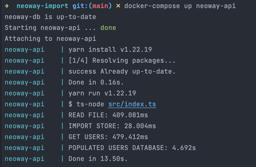

#### Neoway Import 

#### How to run | Como rodar
```shell
  docker-compose up
```

### Stack

- NodeJs
- Typescript 
- Nodemon 
- Typeorm 
- Postgresql


Utilizei um ORM para criação do banco, no teste não especificava se eu precisava utilizar o driver puro, porém farei em outra branch caso seja necessário. 
</br> 
O tempo de execução na minha maquina não passa de 4 segundos 



#### Mistakes | Erros 
Iniciei com a ideia de uma API onde poderia ser feito o upload do arquivo, ou de outro semelhante, 
se olharem no historico do git encontrarão essa versão, só que ao rever o que o teste pedia percebi 
que aquilo era OverEngineer, então refiz essa parte para ser o mais simples possível e entregar 
apenas o que foi pedido.


