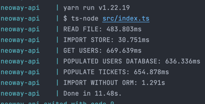
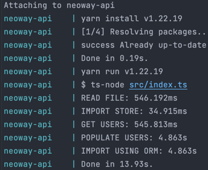
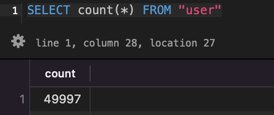
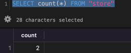
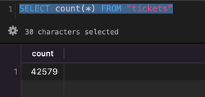

#### Neoway Import 

#### How to run | Como rodar
```shell
  docker-compose up
```

para trocar o arquivo de upload, altere no .env 

Sempre que rodar o serviço limpo o banco, se quiser remover
isso, primeiras linhas do index.js tem a query.

Temos também dois métodos de import, o utilizando o ORM que tem uma perfomance
menor, e sem o ORM, que contem alguns riscos porem tem uma perfomance maior.  

Para alterar só trocar no ``.env`` versionado, o campo IMPORT_METHOD.
```dotenv
IMPORT_METHOD=ORM ## vai usar o ORM 
# IMPORT_METHOD=NULL ## vai usar a query em hardcode 
```
### Stack

- NodeJs
- Typescript 
- Nodemon 
- Typeorm 
- Postgresql


Utilizei um ORM para criação do banco, no teste não especificava se eu precisava 
utilizar o driver puro, porém fiz umas query apenas para garantir, como 
trato os dados antes de salvar o risco de um SQL INJECTION é baixo.

O tempo de execução na minha maquina não passa de ``5 segundos para o import``

Fechando a sessao com o banco e até o fim da execucao do container temos a 
``média de 15s``  

SEM ORM



Com orm



#### Entendimento do problema 
Temos o usuario/cliente e ``o valor do ultimo ticket`` desse cliente,
``a loja da ultima compra`` e ``a data dessa compra``, com isso podemos criar
uma ``tabela`` que armazene os ``tickets`` que irá ter um relacionamento com ``usuario`` e com as ``lojas``,

Temos então um relacionamento de 1-N

users 1---N tickets

tickets N---1 store 

Com esse relacionamento podemos fazer queries que tragam a última loja de um 
usuário pelo ultimo ticket dele. 

Podemos tirar o ``ticket médio`` dele pela divisão da soma de todos os tickets dele. 

O campo de valor separei em dois por não saber exatamente qual liguagem iria consumir
e, sabendo dos problemas enfrentados em algumas ao converter valores do tipo money/decimal 
ao ser convertido virar um float porém arredondando o valor (peguei muitos problemas desse tipo no PHP a muito tempo atrás)


#### Duvidas   
Não ficou claro se era necessário fazer uma API, com upload e etc.

Como era pra ser feito a higienização dos dados,
se era pra ser feito apenas DEPOIS de persistir os dados no banco, 
eu acabei fazendo antes de persistir, até porque eu tenho uma
query em hardcode.





